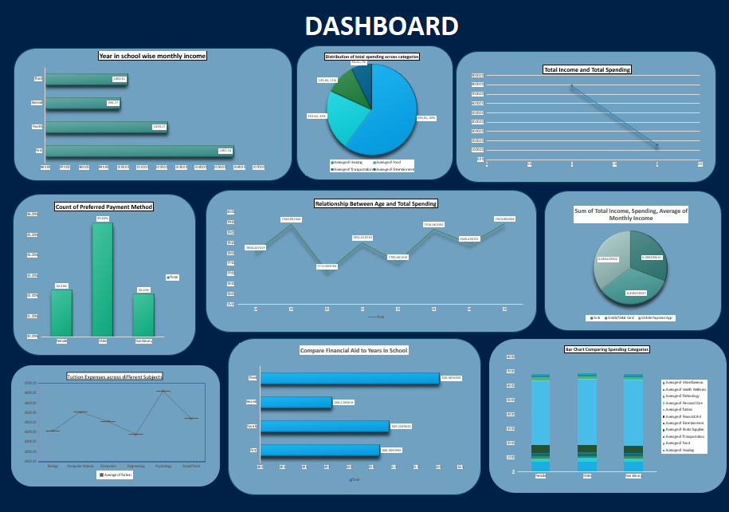

 # Student Spending Analysis

This project analyzes student monthly expenses to understand spending patterns, savings, and budget trends.

**Tools Used:** Excel, Power BI

**Key Insights:**
- Top 3 expense categories for students
- Monthly spending vs savings trend
- Budget vs Actual comparison

**Dashboard Preview:**

